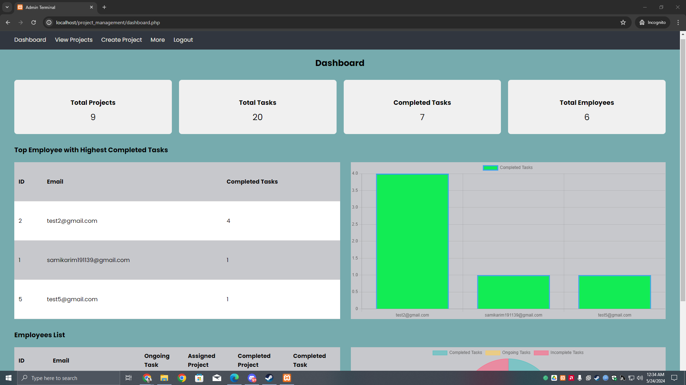

<h1 align="center">Project Task Management System using HTML-CSS-PHP-SQL</h1>

## Table of Contents

- [About](#about)
- [Key Features](#key-features)
  - [Admin](#admin)
  - [Employee](#employee)
- [Made Using](#made-using)
- [How to Run](#how-to-run)
- [Screenshots](#screenshots)
- [Collaborators](#collaborators)
- [Contact](#contact)

## About
- "Project Task Management System" is a System developed using procedural programming principles. This system is designed to streamline project planning, task allocation, and progress tracking, ensuring efficient collaboration and timely project completion.
- This Project uses simplified Project Assignment and Project Status updating structure to ensure employees complete their task in due time.

## Key Features
  ### Admin
  - Admin Control: Only admins can create projects and tasks. He can also set due dates.
  - Task Assignment: Admins can assign multiple tasks to employees.
  - Progress Tracking: Admins can view the overall progress of projects based on the number of completed tasks.
  ### Employee
  - Status View: Can view the status of assigned projects and tasks.
  - Status Management: Employees can update task status to "Incomplete" (default), "Ongoing," or "Complete."

## Made Using
- HTML
- CSS
- SQL
- PHP

## How to Run
  - Install any compatitable compiler in your system.
    - [CodeBlocks Page](https://www.codeblocks.org/downloads/).
    - [VSCode Page](https://code.visualstudio.com/).
  - Clone or download the project from my repository.
    - For the Cloning repository, follow the [GitHub Page](https://github.com/Samiul191139/Project-Task-Management-System-HTML-CSS-PHP-SQL)
  - Install and Open Xampp.
  - Run Apache and MySql.
  - Copy the code folder to htdocs found in Xampp directory.
  - From Database folder in the project, you will find the database pdf. Export it using [xampp admin](http://localhost/phpmyadmin/). Export the pdf file and you will have the database.
  - Now run and enjoy.

## Screenshots
- Login and Registration
  ### Login page

  ### Registration page

- Admin
  ### Admin Dashboard

  ### View Projects

- Employee
  ### Employee Dashboard

  ### View Tasks

  ### Change Status of Tasks

## Collaborators
- Alif Hassan - GitHub [@AnandoHassan](https://github.com/AnandoHassan)
- Sabiha - GitHub [@sabiha318](https://github.com/sabiha318)

## Contact
- GitHub [@Samiul191139](https://github.com/Samiul191139)
